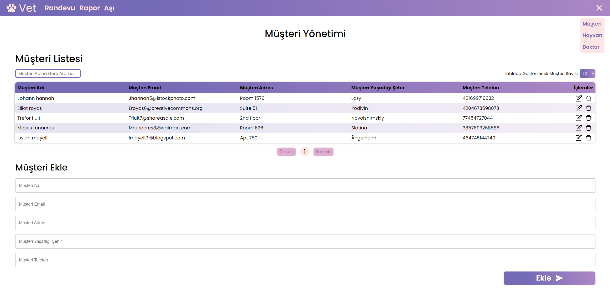

# Veterinary Management System

This project is a management system developed for a veterinary clinic. The system allows performing CRUD (Create, Read, Update, Delete) operations with a live backend and database for animals, customers, doctors, appointments, reports, and vaccines.

## Live Site

You can access the live website [here](https://myveterinaryapp.netlify.app/).



## Technologies Used

- **React:** For building the user interface.
- **TypeScript:** For type safety and improved development experience.
- **React Router:** For routing within the application.
- **React Query:** For data fetching, caching, synchronization, and background updates.
- **Material-UI (MUI):** For modern and responsive UI components.
- **Backend:** Integration with a live backend and database.

## Future Enhancements

Form Management with Formik: Plan to integrate Formik for advanced form management, validation, and handling.

## How To Use

To clone and run this application, you'll need [Git](https://git-scm.com/) and [Node.js](https://nodejs.org/en) installed on your computer.
From your comment line:

```bash
# Clone this repository
$ git clone https://github.com/OguzcanIzanli/Vet-App.git

# Go into the repository
$ cd Vet-App

# Install dependencies
$ npm install

# Run the app
$ npm run dev
```

## Contact

If you have any questions or feedback, please contact us at oguzcanizanli@gmail.com.
